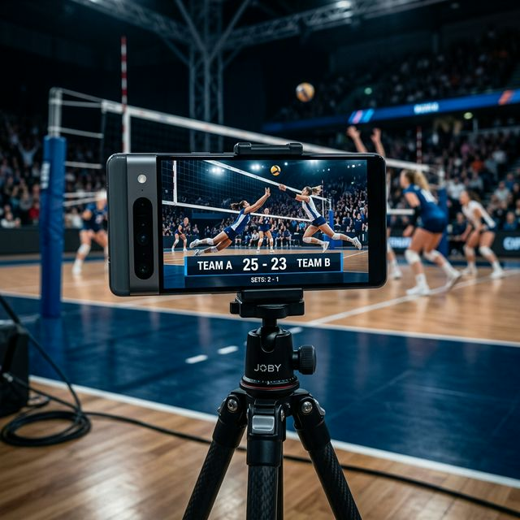

# 🏐 SpikeStream — Volleyball Live Streaming with Real-Time Scoreboard

> **Stream any volleyball match LIVE on YouTube, Twitch, or any RTMP server — with a professional real-time scoreboard overlay directly on the stream.**

SpikeStream is a free Android application designed to make volleyball streaming accessible for everyone, from middle school matches to professional leagues. No expensive equipment needed: just one phone for streaming and a second device to update the score via a shareable link.

---

## 🇮🇹 In breve
SpikeStream è l'app Android gratuita che ti permette di trasmettere in diretta le tue partite di pallavolo con un **segnapunti professionale in tempo reale** sovrapposto allo streaming. Funziona con YouTube, Twitch e qualsiasi server RTMP.

---

## ✨ Key Features

- **📺 Professional Overlay:** A sleek, minimal scoreboard that fits perfectly into your stream.
- **🔗 Collaborative Scoring:** Generate a secret link and send it to a teammate or a parent in the stands. They update the score on their phone, and it updates *instantly* on the live stream.
- **🚀 Multi-Platform support:** Stream to YouTube, Twitch, Facebook Live, or your own custom RTMP server.
- **📱 Responsive Design:** Support for both portrait and landscape streaming with a dynamic UI that adapts to your camera orientation.
- **🔋 Battery Optimizer:** Dimmed screen mode during streaming to ensure you can cover the longest five-set thrillers.
- **🔒 Secure & Private:** Your RTMP URLs are encrypted and never shared.

---

## 🛠️ How it Works

1. **Login & Configure:** Sign in with Google and create your match. Add team names and your destination RTMP URL.
2. **Share the Link:** Tap "Generate Invite Link" and send it to the person who will be the scorer.
3. **Go Live:** Start the stream! While you record the action, the scorer updates points from the web link, and your audience sees the live score on screen.

---

## 🧑‍💻 Technical Stack

- **Streaming Core:** RTMP protocol support for low-latency broadcasting.
- **Graphics Engine:** Custom Canvas-based renderer for high-performance scoreboard overlays.
- **Real-time Sync:** Powered by a backend (Redis/Google Cloud) to ensure $<1s$ latency between the scorer and the stream.

---

## 🚀 Getting Started

To run this project locally:

1. Clone the repository.
2. Open in Android Studio.
3. Add your `local.properties` with the necessary keys (AdMob, etc.).
4. Build and run on a physical device (Camera and Microphone required).

---

## ☕ Support the Project

SpikeStream is an independent, free project. If you find it useful for your team, consider supporting its development:

- [Buy me a coffee](https://ko-fi.com/leonardosartori) ☕
- Leave a review on the Play Store.
- Share your streams and tag us `@spikestream.app`!

---

*Made with ❤️ for the volleyball community.*
